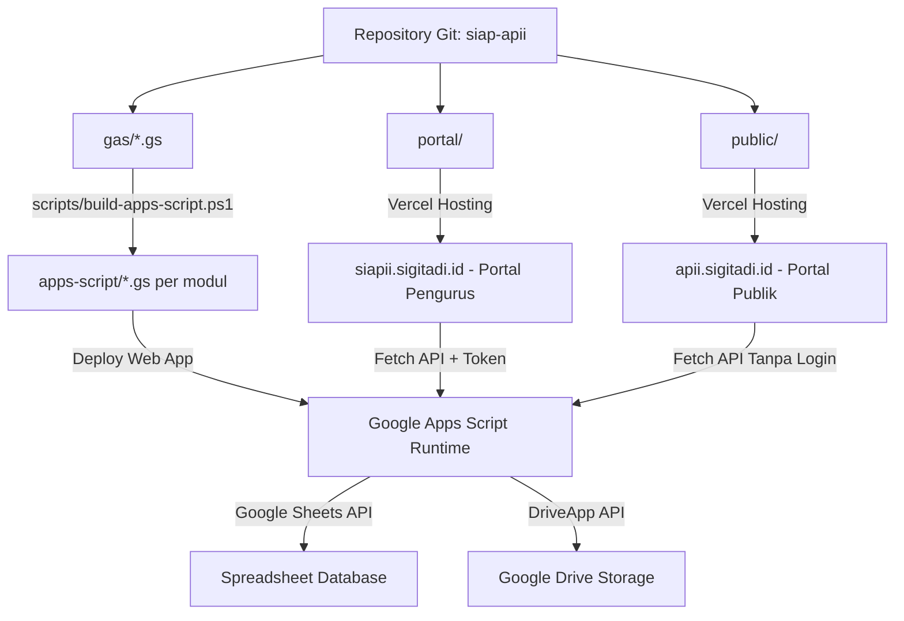

# Panduan Version Control & Deployment Pipeline — SIAP APII

Dokumen ini menjelaskan tata kelola version control, percabangan Git, alur rilis, dan prosedur deployment untuk sistem **SIAP APII (Yayasan APII DPW Jabodetabek)**.

---

## 1. Strategi Percabangan Git (Branching Model)

Proyek ini menerapkan **Trunk-Based / GitHub Flow Modern** dengan branch utama:

| Nama Branch | Lingkungan | Akses | Keterangan |
| :--- | :--- | :--- | :--- |
| `main` | Production | Dilindungi (*Protected*) | Sumber kebenaran rilis produksi untuk Vercel & Apps Script. |
| `feature/*` | Development | Pengembang | Branch fitur baru (contoh: `feature/pendaftaran-uupdp`). |
| `fix/*` | Hotfix | Pengembang | Perbaikan bug kritis yang langsung di-merge ke `main`. |

---

## 2. Standar Pesan Komit (Conventional Commits)

Format standar pesan komit:
```
<type>(<scope>): <deskripsi singkat dalam bahasa indonesia>
```

Tipe komit yang digunakan:
- `feat`: Penambahan fitur atau modul baru (misal: `feat(pendaftaran): form pendaftaran anggota dengan watermark ktp`)
- `fix`: Perbaikan bug atau ketidaksinkronan (misal: `fix(auth): selaraskan status verifikasi pendaftar`)
- `docs`: Pembaruan dokumentasi (misal: `docs: perbarui panduan deploy dan changelog`)
- `style`: Penyesuaian tampilan, CSS, atau responsivitas layar (misal: `style(mobile): card-feed layout untuk tabel`)
- `refactor`: Restrukturisasi kode tanpa mengubah fungsionalitas (misal: `refactor(portal): integrasi cache swr`)
- `chore`: Tugas pemeliharaan build script atau dependensi (misal: `chore: kompilasi bundle apps-script`)

---

## 3. Komponen Sistem & Lokasi Deployment

Sistem SIAP APII terdiri dari 3 komponen utama yang dideploy secara terpisah:



1. **Backend & Logika Serverless**:
   - Sumber: Folder `gas/` (13 file `.gs`).
   - Hasil build: `apps-script/<Modul>.gs` — satu file per modul (`Konfig.gs` … `Code.gs`) + `AsetLogo.gs`, `AsetStempel.gs`, dan `appsscript.json`.
   - Host: Google Apps Script Web App Engine (`script.google.com`).
2. **Portal Pengurus**:
   - Sumber: Folder `portal/` (`index.html`, `portal.js`, `auth.js`, `style.css`, `config.js`).
   - Host: Vercel Production (`https://siapii.sigitadi.id`).
3. **Portal Publik**:
   - Sumber: Folder `public/` (`index.html`, `app.js`, `style.css`, `config.js`).
   - Host: Vercel / Static Web Hosting (`https://apii.sigitadi.id`).

---

## 4. Alur Deployment Lengkap (Release Pipeline)

### Langkah 1: Kompilasi Bundle Google Apps Script
Setiap kali ada perubahan pada logika backend di `gas/`:
```powershell
powershell -ExecutionPolicy Bypass -File .\scripts\build-apps-script.ps1
```
Script ini akan:
1. Membaca setiap file modul `gas/*.gs` secara berurutan.
2. Mengonversi pemanggilan namespace menjadi fungsi global (kompatibel penuh dengan runtime GAS).
3. Menghasilkan `apps-script/<Modul>.gs` — **satu file per modul** — plus `AsetLogo.gs` dan `AsetStempel.gs` (dulu semuanya digabung di satu `Backend.gs`; build dipecah 2026-10-09 karena ukurannya mendekati batas file Apps Script).
4. Menghapus output basi dari build lama (termasuk `apps-script/Backend.gs`) sehingga folder hasil build selalu konsisten.
5. Menyalin manifest `gas/appsscript.json` $\to$ `apps-script/appsscript.json` (wajib ikut saat `clasp push`; isinya identik dengan manifest di project produksi sehingga pengaturan `timeZone`/`webapp` tidak berubah saat rilis).

### Langkah 2: Deploy ke Google Apps Script (satu perintah)
```bash
npm run deploy:gas          # build → validasi → push → periksa editor → cap nomor rilis → versi baru → update deployment
npm run deploy:gas:check    # uji tanpa mengunggah (dry-run), termasuk pemeriksaan editor
npm run version:gas         # bangkitkan apps-script/Versi.gs (sumber angka versi endpoint ping)
npm run check:legacy        # khusus: berkas lama & definisi ganda di editor (tanpa mengubah apa pun)
npm run cleanup:legacy      # khusus: bersihkan berkas lama lewat Apps Script API (dry-run; --yes untuk menulis)
```
Skrip `scripts/deploy-gas.mjs` memakai deployment ID yang sama, sehingga URL Web App (`https://script.google.com/macros/s/.../exec`) tidak berubah dan `portal/config.js` / `public/config.js` tidak perlu diedit.

**Gerbang definisi ganda (langkah 7).** Sebelum versi baru dibuat, deploy menarik isi editor yang sesungguhnya (`clasp pull`) dan memeriksanya dengan [scripts/check-legacy-duplicates.mjs](scripts/check-legacy-duplicates.mjs): berkas apa pun yang bukan keluaran build dilaporkan, definisi nama yang sama antar berkas dihitung, dan setiap simbol berkas lama dicocokkan dengan modul baru. Bila ada simbol berkas lama yang **belum pindah** ke modul baru, deploy berhenti **sebelum** `create-version` (produksi `/exec` tidak berubah) beserta daftar simbolnya; bila yang tersisa hanya berkas yang bukan keluaran build, langkah **7b** membersihkannya sendiri lewat Apps Script API ([scripts/remove-legacy-files.mjs](scripts/remove-legacy-files.mjs)) — tidak ada lagi klik **Delete** manual (lewati dengan `--no-cleanup`). Ini menutup jalur kegagalan "Aksi tidak dikenali": dulu versi baru bisa dibuat selagi `Backend.gs` lama masih tertinggal, sehingga runtime memakai salinan usang tanpa error apa pun.

> **Terbukti di produksi (2026-10-08 – 2026-10-09):** alur ini sudah dijalankan penuh — `push` → `create-version` → `update-deployment` — dan menghasilkan **Versi 12**, **Versi 13** (perbaikan Reset ke Default Drive, 2026-10-09 00:53 WIB), **Versi 14** (build per-modul, 2026-10-10 00:44 WIB), lalu **Versi 15** (pembersihan berkas lama otomatis + laporan versi `ping`, aplikasi 2.5.0, 2026-10-10 01:41 WIB) pada deployment `/exec` yang sama (`…NJdg`) dari `main`. Isi berkas versi tayang **identik** dengan `apps-script/` lokal dan manifest-nya sama dengan `gas/appsscript.json`. Ini menutup catatan lama "langkah versi & deployment belum pernah tuntas dari sisi agent". Ringkasan keadaan produksi ada di [CHANGELOG.md](CHANGELOG.md) → **Status Produksi Terkini**.

Prasyarat sekali saja: `npx --yes @google/clasp@3 login`, `GAS_SCRIPT_ID` pada `.env`, dan **Google Apps Script API** diaktifkan untuk akun tersebut di [script.google.com/home/usersettings](https://script.google.com/home/usersettings).

**Alternatif manual** (bila CLI belum dapat digunakan):
1. Buka editor project Google Apps Script yayasan.
2. Salin isi setiap file `apps-script/*.gs` ke file bernama sama di editor (lihat daftar `$order` di `scripts/build-apps-script.ps1`), lalu hapus `Backend.gs` lama dan sisa berkas lain agar tidak ada definisi fungsi ganda.
3. Klik **Deploy** → **Manage deployments** → Klik ikon pensil (Edit) pada deployment aktif.
4. Ubah versi ke **New version** → Klik **Deploy**.
5. Pastikan URL Web App (`https://script.google.com/macros/s/.../exec`) tetap sesuai di:
   - `portal/config.js` (`window.API_BASE`)
   - `public/config.js` (`window.API_BASE`)

### Langkah 3: Deploy Frontend ke Vercel (CI/CD Otomatis)
Setiap `git push origin main`, Vercel akan otomatis melakukan build dan deploy:
- Project Portal Pengurus mendeteksi perubahan di root atau folder `portal/` dan mengarahkan ke domain `siapii.sigitadi.id`.
- Project Portal Publik mendeteksi folder `public/` dan mengarahkan ke domain `apii.sigitadi.id`.

Jika deploy manual menggunakan Vercel CLI:
```bash
# Deploy Portal Pengurus
cd portal && npx vercel --prod --yes

# Deploy Portal Publik
cd public && npx vercel --prod --yes
```

---

## 4b. Gerbang Pra-Push (Hook Git) — pemeriksaan wajib sebelum `git push`

**Mengapa ada.** Dua bug pada 2026-10-10 lolos ke peramban pengurus sekaligus: penjaga mode demo memblokir aksi login itu sendiri, dan `App.showLogin()` memakai `self` tanpa deklarasi (di peramban `self === window`) sehingga tombol **Masuk sebagai Akun Demo** gagal membuka aplikasi. Keduanya hanya terlihat saat pengguna menekan tombol — `node -c` dan build sama sekali tidak menangkapnya, dan `self` bahkan terdaftar sebagai global peramban sehingga aturan lint biasa pun meloloskannya. Karena setiap `git push origin main` **langsung** memicu build Vercel kedua portal, gerbangnya harus berada di sisi push, bukan setelah tayang.

**Aktifkan sekali per klon:**
```bash
npm run hooks:install      # git config core.hooksPath .githooks + chmod hook
```
Setara manual: `git config core.hooksPath .githooks` (hanya setelan lokal, tidak mengubah repo). `core.hooksPath` perlu disetel karena hook yang ada di dalam repo tidak aktif dengan sendirinya — dan setelan ini **disengaja tidak dipaksa** bagi siapa pun yang tidak menginginkannya.

**Isi gerbang** — `npm run gate:push` ([scripts/pre-push-gate.mjs](../scripts/pre-push-gate.mjs)) menjalankan **14 pemeriksaan offline** (± 15 detik):

| Pemeriksaan | Skrip |
|---|---|
| Pemindai variabel global frontend (alias `self` & nama tak dikenal) | [scripts/check-frontend-globals.mjs](../scripts/check-frontend-globals.mjs) |
| Uji pemindai itu sendiri (termasuk kontrol negatif bug `self`) | [scripts/smoke-frontend-globals.mjs](../scripts/smoke-frontend-globals.mjs) |
| Penjaga mode demo portal · tombol masuk portal | [scripts/smoke-portal-demo-guard.mjs](../scripts/smoke-portal-demo-guard.mjs), [scripts/smoke-portal-login-button.mjs](../scripts/smoke-portal-login-button.mjs) |
| Daftar putih route + smoke backend/redaksi/template | [scripts/validate-routes-whitelist.mjs](../scripts/validate-routes-whitelist.mjs), `smoke:backend`, `smoke:editorial`, `smoke:template` |
| Jalur pemulihan sandi akun — sebab kredensial ditolak dibedakan, penolakan tidak menyentuh data, dan jalurnya **tidak bisa dipanggil lewat HTTP** | [scripts/smoke-auth-recovery.mjs](../scripts/smoke-auth-recovery.mjs) |
| **Portal di peramban sungguhan** — halaman login dimuat dari sebuah ALAMAT lalu tombol Masuk & tombol demo diklik dengan tetikus sungguhan; termasuk skenario "sesi demo basi" | [scripts/smoke-portal-live.mjs](../scripts/smoke-portal-live.mjs) |
| Gerbang definisi ganda, pembersih berkas lama, laporan versi, Drive lokal | `smoke:legacy`, `smoke:cleanup`, `smoke:version`, `smoke:drive:local` |

**Perintah yang sengaja TIDAK ikut**, beserta alasannya: `smoke:deploy` (± 145 detik — terlalu lambat untuk setiap push, jalankan manual), `smoke:drive` (menyentuh Google Drive **produksi**), `check:legacy`/`cleanup:legacy` (menarik isi editor Apps Script lewat jaringan + kredensial `clasp`), serta `build:gas`/`deploy:gas` (menulis rilis sungguhan). Folder `frontend/` (React + TypeScript) juga tidak dipindai: variabel tak dikenal sudah menjadi galat kompilasi `tsc` di sana.

**Gerbang yang sama berjalan di CI dalam mode `--ci`** ([.github/workflows/ci.yml](../.github/workflows/ci.yml), langkah *Pre-Push Gate* → `npm run gate:push -- --ci`). Bundel hasil build `apps-script/*.gs` **sengaja tidak ikut ke repositori** (`.gitignore` baris 62–65), dan aset sumbernya `Dokumen Sumber/` juga tidak — jadi di mesin CI bundel itu memang tidak ada dan tidak bisa dibangkitkan. Konsekuensinya dinyatakan terbuka, bukan disembunyikan: **9 dari 14** pemeriksaan (yang mandiri, termasuk **uji UI portal di peramban sungguhan** — Chrome tersedia di runner GitHub) benar-benar dijalankan di CI, sedangkan **5 pemeriksaan yang membaca bundel dicetak sebagai "dilewati" beserta alasannya** di log CI. Gerbang lengkap (14/14) berjalan otomatis di hook pra-push pada mesin yang punya `Dokumen Sumber/`. Bila suatu saat bundel tersedia di CI, mode `--ci` otomatis menjalankan seluruh 14 pemeriksaan tanpa perlu diubah lagi.

### 4c. Uji UI portal pada ALAMAT PREVIEW (sebelum publish)

Gerbang di atas menguji salinan **lokal** — persis bit yang akan didorong. Sesudah didorong, Vercel membangun **preview** untuk branch tersebut, dan preview itulah yang sebenarnya akan menjadi produksi bila di-merge ke `main`. Karena itu ada dua lapis tambahan:

```bash
npm run smoke:portal:live                              # sajikan portal lokal sendiri, uji di peramban
npm run smoke:portal:live -- --url https://siapii-xxx.vercel.app   # uji ALAMAT PREVIEW
npm run smoke:portal:live -- --url <alamat> --live     # uji sungguhan ke backend (butuh APII_TEST_USER/APII_TEST_PASS)
```

- **Otomatis pada preview deployment:** [.github/workflows/portal-preview.yml](../.github/workflows/portal-preview.yml) dipicu oleh `deployment_status` dari Vercel — begitu status **preview berhasil**, uji peramban dijalankan pada alamat preview itu (deployment produksi dilewati karena sudah tayang). Bisa juga dijalankan manual: **Actions → Uji UI Portal pada Preview Deployment → Run workflow** beserta alamatnya.
- **Tidak menyentuh data produksi:** permintaan API dicegat di sisi halaman (stub) dan nama host API dipetakan ke alamat mati saat peramban diluncurkan. Mode `--live` (login sungguhan, menulis 2 baris audit) **tidak pernah** dipakai oleh workflow otomatis — hanya bila diminta eksplisit.
- **Butuh peramban Chromium** (Chrome/Edge) dan **Node 22+** (WebSocket bawaan dipakai untuk mengendalikan peramban lewat Chrome DevTools Protocol — tanpa paket npm baru). Bila peramban tidak ditemukan, uji keluar dengan kode **2** dan gerbang mencetaknya sebagai **dilewati beserta alasannya** — bukan lulus diam-diam.

**Lewati sekali bila benar-benar darurat:** `SKIP_GATE=1 git push`. Bila `node` tidak ditemukan, hook melewati dirinya sendiri dengan peringatan (bukan menggagalkan push yang sah).

---

## 5. Checklist Verifikasi Pasca-Deploy (Smoke Testing)

- [ ] **Portal Pengurus (`siapii.sigitadi.id`)**:
  - [ ] Login menggunakan akun demo (misal: `ketua` / `apii2026`).
  - [ ] Dashboard memuat statistik kas dan kotak aksi (*Action Inbox*).
  - [ ] Navigasi menu berpindah secara instan (0ms) dengan SWR cache.
  - [ ] Menu Manajemen Pengguna menampilkan tab `👥 Pengurus` dan `📥 Pendaftaran Masuk`.
  - [ ] Klik periksa pendaftar memunculkan pratinjau KTP ber-watermark dan tombol verifikasi.
  - [ ] Modal Kertas Virtual A4 surat dan Kwitansi Kas dapat dibuka dan dicetak.
  - [ ] Menu Pengaturan memuat master rekening, jenis surat baru (`NOTULEN`, `RAPAT`, `BA`), dan KOP.
  - [ ] Tab `📰 Redaksi Konten` memuat kartu 1–8 (hero, profil, warta, kontak, FAQ, simpan, **Riwayat Versi**, **Ekspor/Impor JSON**).
  - [ ] Kartu **Riwayat Versi & Pemulihan** termuat (daftar kosong berarti belum ada penyimpanan perubahan, bukan kegagalan).
  - [ ] **Ekspor Konten Aktif** mengunduh berkas `redaksi-apii-YYYY-MM-DD-HHMM.json`; mengimpor ulang berkas yang sama dijawab *"Isi berkas sama dengan konten aktif"*.
  - [ ] Kartu **Google Drive**: **Uji Koneksi** menjawab *"Koneksi Google Drive terhubung dan izin tulis aktif"* dan nama/ID folder aktif tampil.
  - [ ] Aksi baru tidak pernah dijawab *"Aksi tidak dikenali"*; tanpa token, aksi redaksi & Drive ditolak dengan *"Sesi berakhir atau tidak valid"*.
- [ ] **Portal Publik (`apii.sigitadi.id`)**:
  - [ ] Halaman landing memuat profil yayasan dan 7 divisi kerja.
  - [ ] Formulir Pendaftaran Calon Anggota muncul dengan kartu UU PDP.
  - [ ] Unggah foto KTP memicu watermark otomatis sisi klien tanpa error.
  - [ ] Unggah foto selfie memunculkan pratinjau thumbnail.
  - [ ] Pengiriman pendaftaran berhasil memunculkan modal Tanda Terima Digital dengan nomor `REG-YYYY-XXXX` dan tombol WA.
  - [ ] **Tidak ada** tautan menuju Portal Pengurus maupun formulir verifikasi surat SHA-256.
  - [ ] Seksi dinamis (hero, profil, warta maklumat & agenda, FAQ, kontak) mengikuti data redaksi backend, tanpa error konsol baru.
- [ ] **Backend (langsung ke `/exec`)**:
  - [ ] `?action=ping` → `{"status":"online"}`.
  - [ ] Seluruh aksi yang dipakai `portal/portal.js` dikenali router (tanpa *"Aksi tidak dikenali"*); kontrol dengan satu aksi ngawur tetap ditolak.
  - [ ] Versi Apps Script yang tayang sama dengan bundel `apps-script/` hasil build terakhir.
