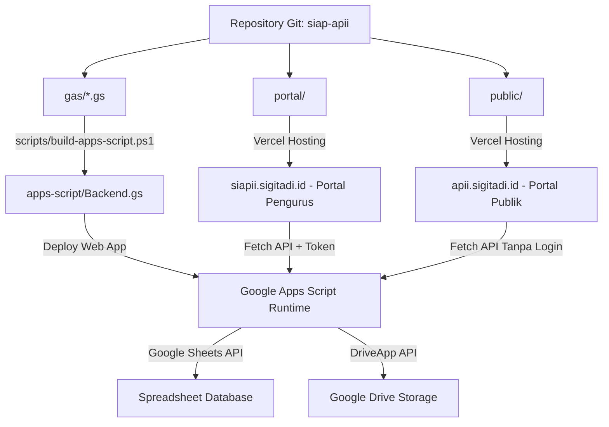

# Panduan Version Control & Deployment Pipeline — SIAP APII

Dokumen ini menjelaskan tata kelola version control, percabangan Git, alur rilis, dan prosedur deployment untuk sistem **SIAP APII (Yayasan APII DPW Jabodetabek)**.

---

## 1. Strategi Percabangan Git (Branching Model)

Proyek ini menerapkan **Trunk-Based / GitHub Flow Modern** dengan branch utama:

| Nama Branch | Lingkungan | Akses | Keterangan |
| :--- | :--- | :--- | :--- |
| `main` | Production | Dilindungi (*Protected*) | Sumber kebenaran rilis produksi untuk Vercel & Apps Script. |
| `feature/*` | Development | Pengembang | Branch fitur baru (contoh: `feature/pendaftaran-uupdp`). |
| `fix/*` | Hotfix | Pengembang | Perbaikan bug kritis yang langsung di-merge ke `main`. |

---

## 2. Standar Pesan Komit (Conventional Commits)

Format standar pesan komit:
```
<type>(<scope>): <deskripsi singkat dalam bahasa indonesia>
```

Tipe komit yang digunakan:
- `feat`: Penambahan fitur atau modul baru (misal: `feat(pendaftaran): form pendaftaran anggota dengan watermark ktp`)
- `fix`: Perbaikan bug atau ketidaksinkronan (misal: `fix(auth): selaraskan status verifikasi pendaftar`)
- `docs`: Pembaruan dokumentasi (misal: `docs: perbarui panduan deploy dan changelog`)
- `style`: Penyesuaian tampilan, CSS, atau responsivitas layar (misal: `style(mobile): card-feed layout untuk tabel`)
- `refactor`: Restrukturisasi kode tanpa mengubah fungsionalitas (misal: `refactor(portal): integrasi cache swr`)
- `chore`: Tugas pemeliharaan build script atau dependensi (misal: `chore: kompilasi bundle apps-script`)

---

## 3. Komponen Sistem & Lokasi Deployment

Sistem SIAP APII terdiri dari 3 komponen utama yang dideploy secara terpisah:



1. **Backend & Logika Serverless**:
   - Sumber: Folder `gas/` (9 file `.gs`).
   - Bundle kompilasi: `apps-script/Backend.gs`, `AsetLogo.gs`, `AsetStempel.gs`.
   - Host: Google Apps Script Web App Engine (`script.google.com`).
2. **Portal Pengurus**:
   - Sumber: Folder `portal/` (`index.html`, `portal.js`, `auth.js`, `style.css`, `config.js`).
   - Host: Vercel Production (`https://siapii.sigitadi.id`).
3. **Portal Publik**:
   - Sumber: Folder `public/` (`index.html`, `app.js`, `style.css`, `config.js`).
   - Host: Vercel / Static Web Hosting (`https://apii.sigitadi.id`).

---

## 4. Alur Deployment Lengkap (Release Pipeline)

### Langkah 1: Kompilasi Bundle Google Apps Script
Setiap kali ada perubahan pada logika backend di `gas/`:
```powershell
powershell -ExecutionPolicy Bypass -File .\scripts\build-apps-script.ps1
```
Script ini akan:
1. Menggabungkan seluruh file modul `gas/*.gs` secara berurutan.
2. Mengonversi pemanggilan namespace menjadi fungsi global (kompatibel penuh dengan runtime GAS).
3. Memperbarui `apps-script/Backend.gs`, `apps-script/AsetLogo.gs`, dan `apps-script/AsetStempel.gs`.
4. Menyalin manifest `gas/appsscript.json` $\to$ `apps-script/appsscript.json` (wajib ikut saat `clasp push`; isinya identik dengan manifest di project produksi sehingga pengaturan `timeZone`/`webapp` tidak berubah saat rilis).

### Langkah 2: Deploy ke Google Apps Script (satu perintah)
```bash
npm run deploy:gas          # build → validasi → push → versi baru → update deployment
npm run deploy:gas:check    # uji tanpa mengunggah (dry-run)
```
Skrip `scripts/deploy-gas.mjs` memakai deployment ID yang sama, sehingga URL Web App (`https://script.google.com/macros/s/.../exec`) tidak berubah dan `portal/config.js` / `public/config.js` tidak perlu diedit.

Prasyarat sekali saja: `npx --yes @google/clasp@3 login`, `GAS_SCRIPT_ID` pada `.env`, dan **Google Apps Script API** diaktifkan untuk akun tersebut di [script.google.com/home/usersettings](https://script.google.com/home/usersettings).

**Alternatif manual** (bila CLI belum dapat digunakan):
1. Buka editor project Google Apps Script yayasan.
2. Salin isi `apps-script/Backend.gs`, `AsetLogo.gs`, dan `AsetStempel.gs` ke editor.
3. Klik **Deploy** → **Manage deployments** → Klik ikon pensil (Edit) pada deployment aktif.
4. Ubah versi ke **New version** → Klik **Deploy**.
5. Pastikan URL Web App (`https://script.google.com/macros/s/.../exec`) tetap sesuai di:
   - `portal/config.js` (`window.API_BASE`)
   - `public/config.js` (`window.API_BASE`)

### Langkah 3: Deploy Frontend ke Vercel (CI/CD Otomatis)
Setiap `git push origin main`, Vercel akan otomatis melakukan build dan deploy:
- Project Portal Pengurus mendeteksi perubahan di root atau folder `portal/` dan mengarahkan ke domain `siapii.sigitadi.id`.
- Project Portal Publik mendeteksi folder `public/` dan mengarahkan ke domain `apii.sigitadi.id`.

Jika deploy manual menggunakan Vercel CLI:
```bash
# Deploy Portal Pengurus
cd portal && npx vercel --prod --yes

# Deploy Portal Publik
cd public && npx vercel --prod --yes
```

---

## 5. Checklist Verifikasi Pasca-Deploy (Smoke Testing)

- [ ] **Portal Pengurus (`siapii.sigitadi.id`)**:
  - [ ] Login menggunakan akun demo (misal: `ketua` / `apii2026`).
  - [ ] Dashboard memuat statistik kas dan kotak aksi (*Action Inbox*).
  - [ ] Navigasi menu berpindah secara instan (0ms) dengan SWR cache.
  - [ ] Menu Manajemen Pengguna menampilkan tab `👥 Pengurus` dan `📥 Pendaftaran Masuk`.
  - [ ] Klik periksa pendaftar memunculkan pratinjau KTP ber-watermark dan tombol verifikasi.
  - [ ] Modal Kertas Virtual A4 surat dan Kwitansi Kas dapat dibuka dan dicetak.
  - [ ] Menu Pengaturan memuat master rekening, jenis surat baru (`NOTULEN`, `RAPAT`, `BA`), dan KOP.
- [ ] **Portal Publik (`apii.sigitadi.id`)**:
  - [ ] Halaman landing memuat profil yayasan dan 7 divisi kerja.
  - [ ] Formulir Pendaftaran Calon Anggota muncul dengan kartu UU PDP.
  - [ ] Unggah foto KTP memicu watermark otomatis sisi klien tanpa error.
  - [ ] Unggah foto selfie memunculkan pratinjau thumbnail.
  - [ ] Pengiriman pendaftaran berhasil memunculkan modal Tanda Terima Digital dengan nomor `REG-YYYY-XXXX` dan tombol WA.
  - [ ] **Tidak ada** tautan menuju Portal Pengurus maupun formulir verifikasi surat SHA-256.
